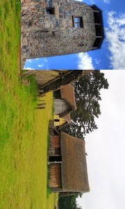
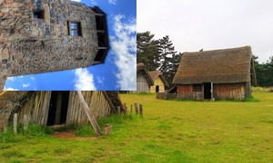
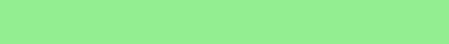
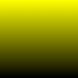
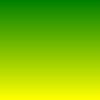
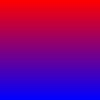
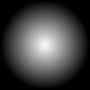

# Colorito

PHP image manipulation library. The library based on ImageMagick tools (Imagick extension). 

 * [Basic](#introduction)
   * [Introduction](#introduction)
   * [Installation](#installation)
   * [Quick start](#quick-start)
   * [Layers](#layers)
 * [Canvas creation](#canvas-creation)
   * [Solid color canvases](#solid-color-canvases)
   * [Gradients of color](#gradients-of-color)
 * Color basics and channels
   * @todo
 * Color Modifications
   * Auto Levels
 * Transformations
   * Crop
   * Flip
   * Flop
   * Opacity
   * Rotation
 * [Effects](#effects)
   * [Generate](#generate)
     * [Fill](#fill)


## Introduction

### What is Colorito?

Colorito is an open source PHP image manipulation library. The library is based on ImageMagick tools. It provides an easier way to create, edit and compose images. It can read and write images in a variety of formats (over 200) including PNG, JPEG, JPEG-2000, GIF, TIFF, DPX, EXR, WebP, Postscript, PDF, and SVG. Use Colorito to resize, flip, mirror, rotate, distort, shear and transform images, adjust image colors, apply various special effects, or draw text, lines, polygons, ellipses and Bézier curves.

Colorito is an great image-to-image converter. It can convert an image in just about any image format to any other image format.

The library follows the FIG guidelines, so it can be integrated easily to an existing project. 


### About examples of Colorito usage

Many examples and descriptions were taken from the ImageMagick documentation and were adapted to use in PHP. So if you were viewing the original documentation, you will meet a lot of familiar words.

I generally use the JPEG formats for images, but in many examples, I use an image in PNG format. The PNG image format supports images with semi-transparent pixels. In this case I use a "checkerboard" pattern for background of the image. I hope, it will be useful. 


## Installation

### System requirements

Colorito requires the following components to work correctly: 

 * PHP >= 7.0
 * Imagick PHP extension
 
### Composer Installation

The best way to install Colorito is quickly with [Composer](http://getcomposer.org/). 

To install the most recent version, run the following command:

```
composer require simbigo/colorito
```


### Usage

```php
use Simbigo\Colorito\Image\Image;

$image = Image::makeFromFile('source.jpg')->saveAs('result.png');
```


## Quick start

### Load images

The simple way to load a image is call static method ```makeFromFile()```:

```php
use Simbigo\Colorito\Image\Image;

$image = Image::makeFromFile('path/to/source.jpg');
```

### Conversion of format

If you want change format of the source image, just save it with necessary extension:

```php
use Simbigo\Colorito\Image\Image;

$image = Image::makeFromFile('path/to/source.jpg');
$image->saveAs('path/to/result.png');
```


## Layers

Each creation or modification operation makes on the Image object. This object is a collection in which each image is presented as a separate layer. At any time, you can apply modifiers and effects to both the individual layer and the image as a whole. When you save image all the layers will be composed in the order in which they were added to the canvas.

In the "Quick Start" section, you could see that we loaded the image using the ```Image::makeFromFile()``` method. If you look behind the scenes, it becomes clear that this method is only an shortcut, and the original image was loaded as the first layer of the Image object.


### Layer creation

There are several ways to add new layers to an image.

1. A clean layer with the specified dimensions will be created.

```php
use Simbigo\Colorito\Image\Image;

$image = new Image();
$image->createLayer(200, 200);
```

2. Create a layer from the image file.

```php
use Simbigo\Colorito\Image\Image;

$image = new Image();
$image->createLayerFromFile('path/to/file.jpg');
```

3. By creating a layer object yourself, you can add both a blank and a layer based on the image.

```php
use Simbigo\Colorito\Image\Image;
use Simbigo\Colorito\Image\Layer;

$image = new Image();
$layer = new Layer();
$layer->loadFile('path/to/source.jpg');
$image->addLayer($layer);
```


### Access to layers

```php
use Simbigo\Colorito\Image\Image;
use Simbigo\Colorito\Image\Layer;

$image = Image::makeFromFile('first.jpg');
$image->createLayerFromFile('second.jpg');


// getting the layers by index

$firstLayer = $image->getFirstLayer();
$secondLayer = $image->getLayer(1);
$lastLayer = $image->getLastLayer();


// control the number of layers

if (!$image->hasLayer(2)) {
    $thirdLayer = new Layer();
    $thirdLayer->loadFile('third.jpg');
    $image->addLayer($thirdLayer);
}

if ($image->countLayers() === 3) {
    echo 'OK';
}


// iterate
$layers = $image->getLayers();
foreach ($layers as $layer) {
    // some magic
}
```


### Editing

Below you can see examples of the transformation applied to different objects. In the first case, we rotate the entire image, and in the second only a separate layer.


```php
use Simbigo\Colorito\Image\Image;
use Simbigo\Colorito\Transform\Rotation;

$image = new Image();
$image->createLayerFromFile('village.jpg');
$image->createLayerFromFile('tower.jpg');
$image->transform(new Rotation(90));
$image->saveAs('rotation_img.jpg');
```



```php
use Simbigo\Colorito\Image\Image;
use Simbigo\Colorito\Transform\Rotation;

$image = new Image();
$image->createLayerFromFile('village.jpg');
$image->createLayerFromFile('tower.jpg')->transform(new Rotation(90));
$image->saveAs('rotation_layer.jpg');
```




## Solid color canvases

When you create a image you are getting Image object. It doesn't have some layers. If you don't have a plan to save an empty image, you need to create a new layer and to make all manipulations with it. See "Layers" section for more information. 

1. Using Image::setBackground() method.

```php
use Simbigo\Colorito\Color\Color;
use Simbigo\Colorito\Image\Image;

$image = new Image();
$image->setBackground(Color::LIGHT_GREEN);
$image->createLayer(500, 50);
$image->saveAs('solid_green.jpg');
```



2. Set background on create the layer.

```php
use Simbigo\Colorito\Color\Color;
use Simbigo\Colorito\Image\Image;

$image = new Image();
$image->createLayer(500, 50, new Color(Color::LIGHT_BLUE));
$image->saveAs('solid_blue.jpg');
```


3. Use Fill effect.

```php
use Simbigo\Colorito\Color;
use Simbigo\Colorito\Effects\Generate\Fill;
use Simbigo\Colorito\Image\Image;

$fill = new Fill(new Color('gold'));

$image = new Image();
$image->createLayer(500, 50)->effect($fill);
$image->saveAs('solid_gold.jpg');
```


## Gradients of color


As you saw above you can create canvases of solid colors easy enough. But sometimes you want something more interesting. And Imager provides a number of special effects that will let you do this.

One of the most common ways to create a image is gradient. 

#### Linear gradients.

```php
use Simbigo\Colorito\Effects\Generate\LinearGradient;
use Simbigo\Colorito\Image\Image;

$image = new Image();
$layer = $image->createLayer(500, 100);
$layer->effect(new LinearGradient());
$image->saveAs('gradient_default.jpg');
```


As you can see by default LinearGradient will create an image with white at the top, and black at the bottom, and a smooth shading of grey across the height of the image.

But it does not have to be only a grey-scale gradient, you can also generate a gradient of different colors by either specifying one color, or both. 

```php
use Simbigo\Colorito\Color;
use Simbigo\Colorito\Effects\Generate\LinearGradient;
use Simbigo\Colorito\Image\Image;

$colors = [
    ['startColor' => new Color('blue'), 'endColor' => new Color('white')],
    ['startColor' => new Color('yellow'), 'endColor' => new Color('black')],
    ['startColor' => new Color('green'), 'endColor' => new Color('yellow')],
    ['startColor' => new Color('red'), 'endColor' => new Color('blue')],
    ['startColor' => new Color('tomato'), 'endColor' => new Color('steelblue')],
];

$gradient = new LinearGradient(new Color('white'), new Color('white'));
$image = new Image();
$image->createLayer(100, 100)->effect($gradient);
foreach ($colors as $color) {
    $endColor = $color['endColor'];
    $startColor = $color['startColor'];

    if ($startColor !== null) {
        $gradient->setStartColor($startColor);
    }
    if ($endColor !== null) {
        $gradient->setEndColor($endColor);
    }

    $image->saveAs('gradient_' . $startColor->getValue() . '-' . $endColor->getValue() . '.jpg');
}
```







#### Radial gradients.

You can also generate radial gradient images in a similar way. 

```php
use Simbigo\Colorito\Color;
use Simbigo\Colorito\Effects\Generate\RadialGradient;
use Simbigo\Colorito\Image\Image;

$gradient = new RadialGradient(new Color('white'), new Color('black'));

$image = new Image();
$image->createLayer(100, 100)->effect($gradient);
$image->saveAs('radial_gradient_default.jpg');
```




## Effects

### Generate

#### Fill

The Fill effect fills specified masks with a specified color.

```php
use Simbigo\Colorito\Color;
use Simbigo\Colorito\Effects\Generate\Fill;
use Simbigo\Colorito\Image\Image;

$fill = new Fill(new Color('orange'), 0.5);
Image::makeFromFile('village.jpg')->effect($fill)->saveAs('fill.jpg');
```


